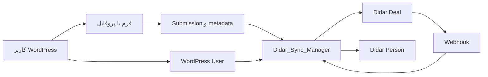
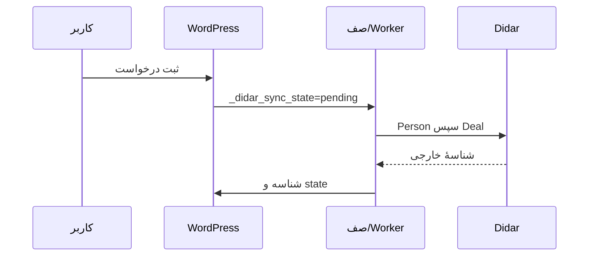

# ns-didar

افزونهٔ WordPress برای ثبت و مدیریت درخواست‌های ازپیش‌تعریف‌شده و همگام‌سازی امن آن‌ها با Didar CRM.

## معرفی

قابلیت پروفایل کاربر شامل «تاریخ تولد» و «کد ملی» است. «مقدار پیش‌فرض» فرم فقط مقدار اولیه فیلد است و مقدار ویرایش‌شده کاربر را جایگزین نمی‌کند.

تنظیمات فیلدهای فرم‌ها در پنل مدیریت اکنون در یک جدول یکپارچه برای هر فرم ارائه می‌شود؛ وضعیت ضروری/اختیاری، نگاشت Didar و مقدار پیش‌فرض هر فیلد در همان ردیف مدیریت می‌شوند.

در همه فیلدهای تاریخ، نمایش و ورود با تقویم جلالی انجام می‌شود اما ذخیره‌سازی و انتقال ماشینی همیشه Gregorian ISO با قالب `YYYY-MM-DD` است. تبدیل تقویم ابتدا با قابلیت بومی PHP `IntlCalendar` و در نبود آن با fallback داخلی انجام می‌شود؛ بنابراین نصب extension یا تغییر تنظیمات hosting لازم نیست و وابستگی شخص‌ثالث یا CDN افزوده نشده است.

هر درخواست به‌صورت `didar_submission` نگهداری می‌شود. کاربران واردشده فرم‌های مجاز را ثبت و سوابق خود را می‌بینند؛ تیم داخلی آن‌ها را با وضعیت و مسئول پیگیری می‌کند. در صورت پیکربندی API، پروفایل کاربر با Didar Person و درخواست با Didar Deal همگام می‌شود.

## قابلیت‌های اصلی

- رجیستری فرم ثابت، اعتبارسنجی سمت‌سرور و shortcodeهای فرانت‌اند
- درخواست، جست‌وجو، صفحه‌بندی، جزئیات و ویرایش محدود فرانت‌اند
- وضعیت داخلی/عمومی، تخصیص مسئول و تاریخچهٔ رویدادها
- نقش‌های `didar_colleague` و `didar_broker` و capabilityهای مدیریتی
- فایل خصوصی، دانلود امن یا مستقیم و پاک‌سازی فایل موقت
- پروفایل کاربر، Person Sync، Deal Sync و webhook
- field/workflow mapping، صف پایدار، retry، worker و diagnostics
- انتقال تنظیمات با allowlist

## معماری کلی



## مدل داده

دادهٔ درخواست در `wp_posts`/`wp_postmeta`، دادهٔ کاربر در `wp_users`/`wp_usermeta`، تنظیمات در `wp_options` و فایل‌ها و تاریخچه در جدول‌های اختصاصی افزونه ذخیره می‌شوند. `_didar_person_id`، `_didar_deal_id` و `_didar_sync_state` شناسه‌ها و حالت sync را نگه می‌دارند.

## نقش‌های کاربری

`didar_colleague` دسترسی محدود همکار دارد. `didar_broker` capabilityهای مدیریتی Didar را می‌گیرد. Administrator نیز capabilityهای Didar را دریافت می‌کند. افزونه هیچ کاربری را Administrator نمی‌کند و webhook کاربر WordPress ایجاد نمی‌کند.

## جریان ثبت و همگام‌سازی



جزئیات Person و Deal در [جریان‌های همگام‌سازی](docs/07-sync-flows.md) آمده است.

## Webhook

مسیر ورودی امن، `POST /wp-json/didar/v1/webhook/{webhook-secret}` است. محدودسازی نرخ، dedupe و جلوگیری از loop دارد. secret واقعی را منتشر نکنید.

محدودیت چرخهٔ عمر: حذف یا archive کردن Deal در Didar پشتیبانی نمی‌شود؛ تغییر lifecycle محلی فقط ثبت می‌شود و حذف/آرشیو remote انجام نمی‌گیرد.

## امنیت و Cron

کنترل‌های اصلی nonce، capability، مالکیت، allowlist، escaping، حفاظت فایل، secret webhook، lock و شناسه‌های پایدار است. رویدادهای فوری و worker پنج‌دقیقه‌ای pending sync را بازیابی می‌کنند و bootstrap عادی scheduleهای ضروری را self-heal می‌کند.

## نصب

1. افزونه را در `wp-content/plugins/ns-didar` قرار دهید و فعال کنید.
2. تنظیمات Didar، workflow، نگاشت‌ها و صفحه‌های shortcode را کامل کنید.
3. برای production، WP-Cron واقعی سرور را فعال کنید.

## انتشار در Production

از پوشهٔ قبلی backup بگیرید، پوشهٔ قدیمی را rename/remove کنید و بستهٔ تمیز را دقیقاً در `wp-content/plugins/ns-didar/` استخراج کنید. وجود `didar.php` و نبود `wp-content/plugins/ns-didar/ns-didar/` را تأیید کنید. سپس تنظیمات، admin، فرم، Person sync، Deal sync خودکار، webhook و diagnostics را بررسی کنید. [راهنمای کامل](docs/18-deployment.md) شامل rollback است.

## ساختار پروژه

```text
ns-didar/
├── didar.php
├── includes/
├── assets/
├── languages/
├── tests/
└── docs/
```

## مستندات کامل

- [نمای کلی](docs/01-overview.md) · [معماری](docs/02-architecture.md) · [فرم‌ها](docs/03-forms-and-submissions.md) · [دسترسی](docs/04-users-and-access-control.md)
- [پروفایل](docs/05-user-profile.md) · [یکپارچگی Didar](docs/06-didar-integration.md) · [جریان‌ها](docs/07-sync-flows.md) · [Webhook](docs/08-webhook.md)
- [گردش‌کار](docs/09-workflows-and-statuses.md) · [فایل‌ها](docs/10-files.md) · [لاگ‌ها](docs/11-event-log-and-diagnostics.md) · [تنظیمات](docs/12-settings.md)
- [انتقال تنظیمات](docs/13-settings-import-export.md) · [Cron](docs/14-background-jobs-and-cron.md) · [امنیت](docs/15-security.md) · [ذخیره‌سازی](docs/16-database-and-storage.md)
- [Hookها](docs/17-hooks-and-extension-points.md) · [استقرار](docs/18-deployment.md) · [رفع اشکال](docs/19-troubleshooting.md) · [راهنمای توسعه](docs/20-developer-guide.md)

## نیازمندی‌ها

- WordPress `6.4` یا بالاتر
- PHP `7.4` یا بالاتر
- Didar CRM و API key فقط برای همگام‌سازی اختیاری لازم‌اند.
- Digits اجباری نیست؛ در صورت وجود، سازگاری موبایل دارد.

## توسعه

تعریف فرم باید در `Didar_Form_Registry` باقی بماند. [راهنمای توسعه](docs/20-developer-guide.md) را دنبال کنید.

## امنیت و گزارش آسیب‌پذیری

گزارش امنیتی را خصوصی برای نگه‌دارندهٔ مخزن ارسال کنید؛ secret، API key یا دادهٔ واقعی مشتری را در issue عمومی نگذارید.

## فرم‌ها و اسناد همراه

کد ملی در فیلدهای معنایی فقط رقم و به‌صورت رشته ذخیره می‌شود. شماره گذرنامه در همه فرم‌ها دقیقاً یک حرف انگلیسی و هشت رقم است. درخواست ویزا از `first_name` و `last_name` استفاده می‌کند و `full_name` برای داده‌های قدیمی حفظ می‌شود. فایل‌های همراه با کلید منطقی `companions.<index>.<field>` به File Service امن متصل هستند.

## License

مجوز انتشار هنوز در مخزن تعریف نشده است.
