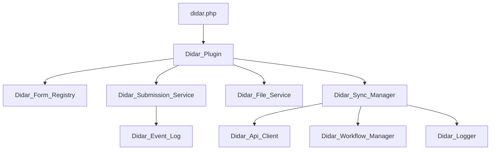

# معماری

| کلاس | مسئولیت |
|---|---|
| `Didar_Plugin` | boot، lifecycle و سلامت workerها |
| `Didar_Post_Type` | CPT `didar_submission` |
| `Didar_Form_Registry` / `Didar_Reference_Data` | فرم‌ها و دادهٔ مرجع |
| `Didar_Field_Renderer` / `Didar_Validator` | نمایش و اعتبارسنجی |
| `Didar_Submission_Service` | ایجاد، تغییر، workflow و دسترسی |
| `Didar_File_Service` | رکورد و ذخیرهٔ فایل خصوصی |
| `Didar_Sync_Manager` / `Didar_Field_Mapper` | صف و تبدیل داده به Didar |
| `Didar_Event_Log` / `Didar_Logger` | رخداد کسب‌وکاری و diagnostic |

activation نقش‌ها، schemaها و scheduleها را آماده می‌کند؛ deactivation scheduleهای افزونه را پاک می‌کند. bootstrap عادی `maybe_upgrade`/`maybe_repair` و بازیابی schedule را اجرا می‌کند.
