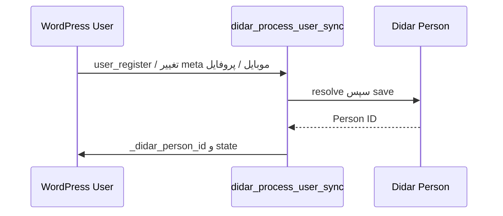

# جریان‌های همگام‌سازی

> جزئیات رفتار Case همراهان در [docs/21-companion-cases.md](21-companion-cases.md) آمده است.

Submission وردپرس یک بار ذخیره می‌شود و companions پست جدا نمی‌سازند؛ پس از Deal، هر ردیف فعال به یک Case با همان `DealId` تبدیل می‌شود.



```mermaid
sequenceDiagram
 participant S as Submission
 participant Q as didar_process_sync
 participant D as Didar Deal
 S->>Q: state=pending + trace_id
 Q->>Q: lock 120s
 Q->>D: Person، سپس resolve/create/update Deal
 D-->>Q: Deal ID
 Q->>S: _didar_deal_id; state=synced
```

ثبت، تغییر، workflow change و ذخیرهٔ admin هر کدام یک intent صریح می‌سازند. هر intent یک generation یکتا با حداکثر ۳ تلاش خودکار دارد؛ اجرای اول نیز جزو سقف است. `manual_sync` override دستی همان generation است و retry خودکار تازه ایجاد نمی‌کند. sweep پنج‌دقیقه‌ای فقط generation pending و واجد شرایط را بازیابی می‌کند. webhook با suppression مانع ایجاد generation خروجی از update ورودی می‌شود.

Webhook Deal، snapshot فیلدهای نگاشت‌شده، status داخلی/عمومی و owner را در درخواستِ متصل به‌روزرسانی می‌کند. اگر رویداد از نوع create باشد و `form_type` و WordPress user از فیلدهای سیستمی resolve شوند، یک درخواست محلی ساخته می‌شود؛ webhook Person فقط ثبت diagnostic دارد و پروفایل/کاربر WordPress را تغییر یا ایجاد نمی‌کند.
