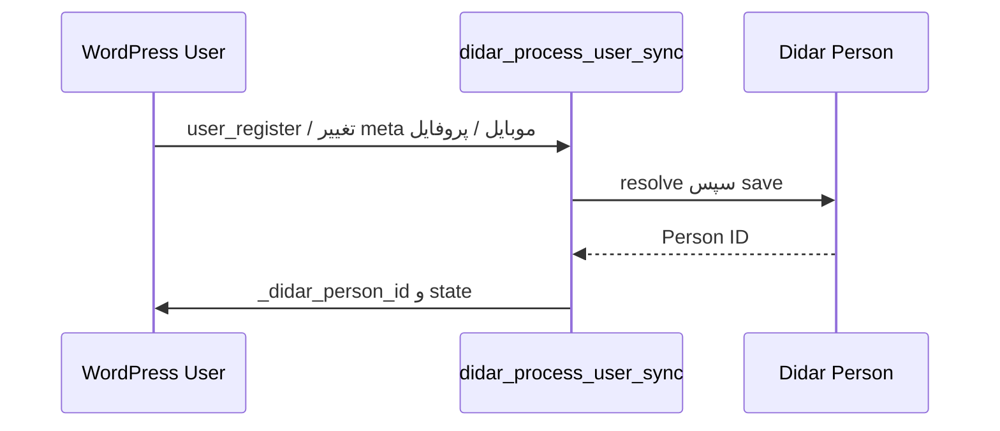

# جریان‌های همگام‌سازی



```mermaid
sequenceDiagram
 participant S as Submission
 participant Q as didar_process_sync
 participant D as Didar Deal
 S->>Q: state=pending + trace_id
 Q->>Q: lock 120s
 Q->>D: Person، سپس resolve/create/update Deal
 D-->>Q: Deal ID
 Q->>S: _didar_deal_id; state=synced
```

ثبت، تغییر، workflow change و ذخیرهٔ admin sync را trigger می‌کنند. `manual_sync` همان مسیر مرکزی را فوری اجرا می‌کند. retry تا ۱۰ تلاش با تأخیر خطیِ حداقل ۶۰ ثانیه و سقف یک ساعت است؛ sweep پنج‌دقیقه‌ای رویداد گم‌شده را بازیابی می‌کند. webhook با suppression مانع بازصف‌شدن update ورودی می‌شود.

Webhook Deal، snapshot فیلدهای نگاشت‌شده، status داخلی/عمومی و owner را در درخواستِ متصل به‌روزرسانی می‌کند. اگر رویداد از نوع create باشد و `form_type` و WordPress user از فیلدهای سیستمی resolve شوند، یک درخواست محلی ساخته می‌شود؛ webhook Person فقط ثبت diagnostic دارد و پروفایل/کاربر WordPress را تغییر یا ایجاد نمی‌کند.
