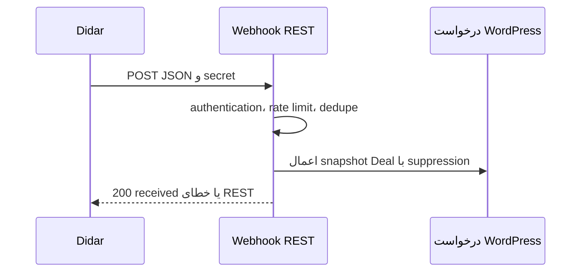

# Webhook

دو route ثبت می‌شود: `POST /wp-json/didar/v1/webhook/{secret}` که `{secret}` دقیقاً ۶۴ نویسهٔ hex است، و route قدیمی `POST /wp-json/didar/v1/webhook`. مسیر عملیاتی باید URL تولیدشده از تنظیمات باشد. route قدیمی فقط وقتی `didar_webhook_legacy_enabled` فعال باشد و header `x-didar-webhook-token` با secret پیکربندی‌شده برابر باشد، authenticate می‌شود.

ورودی `application/json`، `data`، `meta` و شناسه/نوع موجودیت لازم را اعتبارسنجی می‌کند، rate limit برابر ۱۲۰ درخواست در ۶۰ ثانیه دارد و event ID را در `didar_seen_webhooks` (حداکثر ۵۰۰ مورد) dedupe می‌کند. فقط actionهای create/update برای Person و Deal پشتیبانی می‌شوند. webhook Person صرفاً diagnostic ثبت می‌کند و کاربر یا پروفایل WordPress ایجاد/ویرایش نمی‌کند. Deal ورودی ابتدا با `_didar_deal_id` و سپس custom field شناسهٔ submission متصل می‌شود؛ در create، در صورت resolve شدن form/user از فیلدهای سیستمی، درخواست محلی می‌سازد. payload بدفرم، secret نامعتبر، content type نادرست، نرخ زیاد یا رویداد پشتیبانی‌نشده با خطای REST رد می‌شود؛ رویداد تکراری پاسخ ۲۰۰ با `duplicate` می‌گیرد.
