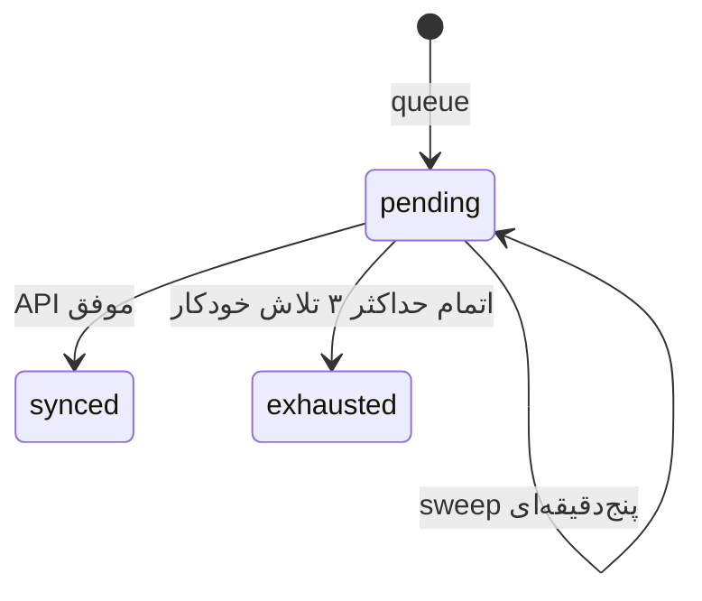
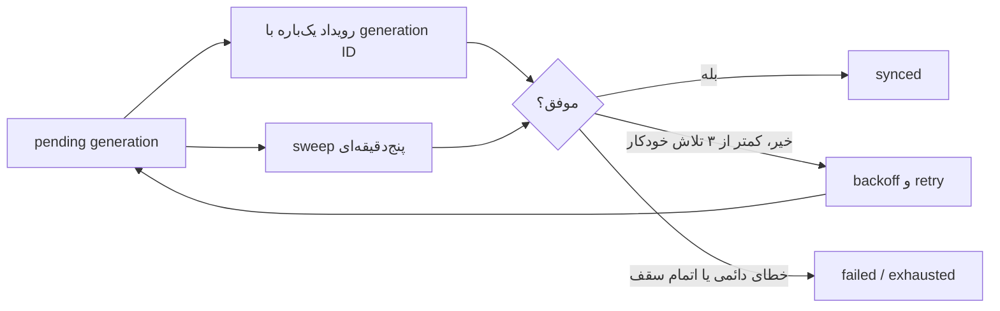

# پردازش پس‌زمینه و Cron

> جزئیات رفتار Case همراهان در [docs/21-companion-cases.md](21-companion-cases.md) آمده است.

`didar_process_sync` و `didar_process_user_sync` هم رویداد تک‌بارهٔ شناسه‌دار و هم worker بدون آرگومان هر پنج دقیقه دارند. sweep در هر نوبت حداکثر ۱۰ submission یا user pending را پردازش می‌کند. `Didar_Plugin::ensure_runtime_workers()` در bootstrap عادی نیز scheduleهای گم‌شده و cleanup روزانهٔ `didar_cleanup_temporary_uploads` را بازمی‌سازد.

lock هر submission در option با پیشوند `didar_submission_sync_lock_` و TTL ۱۲۰ ثانیه است. `spawn_cron()` فقط تلاش سریع پس از persist است؛ پایداری به `_didar_sync_state` و sweep متکی است. برای production، WP-Cron واقعی/سیستمی را طوری تنظیم کنید که بازدید سایت شرط اجرای job نباشد.

در صفحهٔ `تشخیص و گزارش`، گزینهٔ `پاک کردن کامل صف همگام‌سازی` فقط با POST، capability و nonce اجرا می‌شود. این گزینه stateهای pending/retry مربوط به submission، Case و Person، رویدادهای تک‌بارهٔ دارای شناسه و lockهای منقضی را حذف می‌کند و هیچ callback یا درخواست Didar اجرا نمی‌شود. stateهای sync‌شده، شناسه‌های Deal/Person/Case، درخواست‌ها و کاربران حفظ می‌شوند. workerهای recurring باقی می‌مانند تا خطاهای آینده دوباره به‌صورت عادی queue شوند. اگر پردازشی پیش از purge در حال اجرا باشد، لغو آن از طریق این گزینه تضمین نمی‌شود.

## مدیریت موردی صف

بخش `مدیریت صف همگام‌سازی` در همان صفحه، inventory محلی `_didar_sync_state`، `_didar_person_sync_state`، stateهای Case و فقط eventهای شناسه‌دار `didar_process_sync` و `didar_process_user_sync` را نمایش می‌دهد. event زمان‌بندی‌شده به state پایدار همان submission یا Person متصل می‌شود تا یک job منطقی دو بار نمایش داده نشود. باز کردن صفحه هیچ تماس Didar ندارد.

- `اجرای فوری` override دستی است. برای generation exhausted نیز مجاز است، اما failure دستی زنجیرهٔ retry خودکار تازه ایجاد نمی‌کند. قفل فعال submission اجرای هم‌زمان و حذف آن را متوقف می‌کند؛ قفل منقضی طبق سیاست فعلی worker پاک‌سازی می‌شود.
- Caseها اطلاعاتی هستند: retry Case با worker submission والد انجام می‌شود و مسیر اجرای مستقل ندارند. حذف موردی Case فقط state retry محلی را discarded می‌کند و cron والد را حذف نمی‌کند.
- `حذف از صف` فقط همان state و event تک‌بارهٔ وابسته را حذف می‌کند، هیچ callback یا درخواست Didar اجرا نمی‌کند و IDهای Deal، Person و Case را نگه می‌دارد.
- `پاک کردن کامل صف همگام‌سازی` همچنان عملیات گستردهٔ قبلی است؛ مدیریت موردی جایگزین آن نیست.

## نسل همگام‌سازی و سقف retry

هر save صریح کاربر/ادمین یک `generation_id` یکتا می‌سازد؛ حتی اگر مقدار نهایی با save قبلی یکسان باشد. fingerprint فقط برای تشخیص retry/cron تکراری همان generation است، نه جلوگیری از save صریح هم‌ارزش. تغییرات داخلی metadata، worker، history، IDهای Didar و webhook ورودی generation جدید نمی‌سازند.

- هر generation حداکثر **۳ تلاش خودکار** دارد: اجرای اول نیز جزو سقف است.
- event تک‌باره با `(object_id, generation_id)` شناسایی می‌شود؛ برای یک generation بیش از یک event آینده ایجاد نمی‌شود.
- قبل از هر اجرای خودکار، worker زیر lock تلاش را reserve می‌کند. callback قدیمی، generation نامطابق، `synced` یا `exhausted` بدون تماس Didar no-op است.
- موفقیت terminal است: eventهای موردی حذف و generation `synced` می‌شود.
- failure سوم `exhausted` است؛ sweep و cron آن را اجرا نمی‌کنند. اجرای دستی فقط شمارندهٔ `manual_attempts` را افزایش می‌دهد و retry خودکار را reset یا بازسازی نمی‌کند.
- Person نیز همین قرارداد را با state و lock مستقل دارد. Case مستقل queue نمی‌شود و در generation submission والد اجرا می‌شود.
- state قدیمیِ فاقد generation با شمارندهٔ موجود normalize می‌شود. اگر شمارنده قابل اعتماد نداشته باشد، conservatively exhausted می‌ماند و خودکار replay نمی‌شود.
