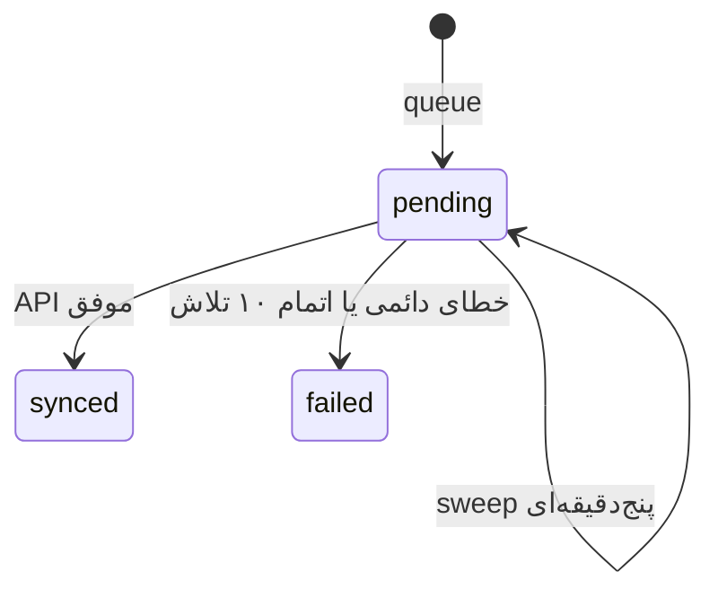
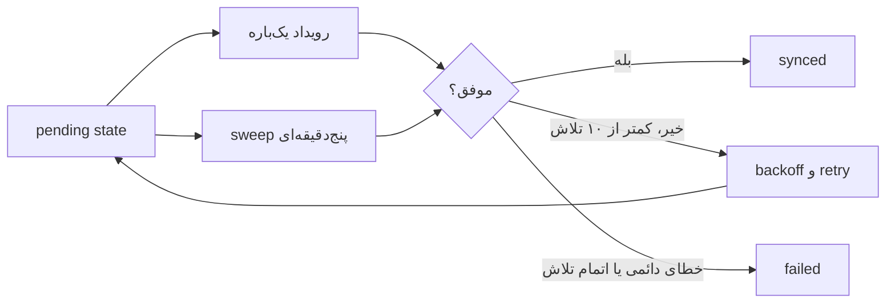

# پردازش پس‌زمینه و Cron

> جزئیات رفتار Case همراهان در [docs/21-companion-cases.md](21-companion-cases.md) آمده است.

`didar_process_sync` و `didar_process_user_sync` هم رویداد تک‌بارهٔ شناسه‌دار و هم worker بدون آرگومان هر پنج دقیقه دارند. sweep در هر نوبت حداکثر ۱۰ submission یا user pending را پردازش می‌کند. `Didar_Plugin::ensure_runtime_workers()` در bootstrap عادی نیز scheduleهای گم‌شده و cleanup روزانهٔ `didar_cleanup_temporary_uploads` را بازمی‌سازد.

lock هر submission در option با پیشوند `didar_submission_sync_lock_` و TTL ۱۲۰ ثانیه است. `spawn_cron()` فقط تلاش سریع پس از persist است؛ پایداری به `_didar_sync_state` و sweep متکی است. برای production، WP-Cron واقعی/سیستمی را طوری تنظیم کنید که بازدید سایت شرط اجرای job نباشد.

