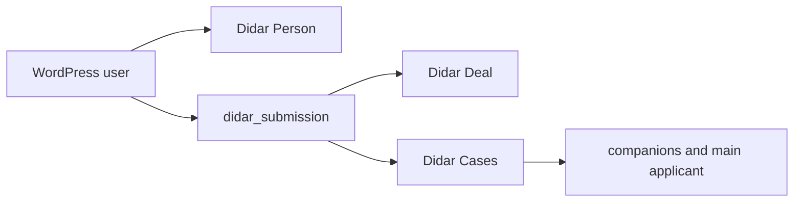

# ns-didar project handoff

**LAST VERIFIED: 2026-09-13**

**SOURCE OF TRUTH: current source, `Didar_Form_Registry`, current settings schema, current tests, then current git diff.** Do not treat old numbered documents or earlier audit counts as current truth.

## Read this first

1. `../Agents.md` for operating and safety rules.
2. This file for current architecture, configuration gaps, and QA limits.
3. `includes/class-didar-form-registry.php` before touching form fields, defaults, options, validation, or mappings.
4. `includes/class-didar-settings.php` and `includes/class-didar-settings-transfer.php` before changing settings or import/export.

The repository HEAD is `b5f127d637ce724ce34b8b36e211d3eeeca068a6` (`final implemention v1`). The Phase 2–8, Iran/geography, file, PDF, searchable-select, and latest Visa conditional work are uncommitted working-tree changes. This handoff documents that working tree, not only HEAD.

## What the plugin is

`ns-didar` is a fixed-form WordPress request system with optional Didar CRM synchronization. It is not a form builder. `Didar_Post_Type::POST_TYPE` is `didar_submission`; one submission uses `post_author` as its request owner, `_didar_form_type` as its stable form key, `_didar_fields` for validated form data, and `_didar_shared_note` for the applicant note.



Companions never make additional WordPress submissions. They are repeater rows inside the one parent submission and may become Cases only after the parent Deal has a durable Didar ID.

## Active forms and registry contract

The five active `Didar_Form_Registry` keys are:

| Key | Persian label | Purpose | Companions / main Case | Important current additions |
|---|---|---|---|---|
| `consultation` | درخواست مشاوره | Consultation lead | No | `preferred_date`, `preferred_time`, `applicant_note` |
| `embassy_appointment` | درخواست وقت سفارت | Embassy appointment request | Yes / supported when configured | `request_for`, Iran birth geography, derived `companions_count`, shared companion rows |
| `traveler_evaluation` | فرم ارزیابی اطلاعات مسافران ویزاخان | Detailed travel questionnaire | No | Shared searchable country fields, `applicant_note` |
| `complaint_suggestion` | ثبت شکایات و پیشنهادات ویزاخان | Complaint/suggestion | No | `applicant_note` |
| `visa_request` | درخواست ویزا | Visa application | Yes / supported when configured | `request_for`, Iran birth geography, Visa history, travel-date range, derived `companions_count` |

Renderer (`Didar_Field_Renderer`), validator (`Didar_Validator`), submission service, settings UI, readable serializer, and mapping code consume this registry. Keep canonical stored option values stable. Validate selects through registered options, including legacy options where a field has `allow_legacy`.

### Defaults and edit precedence

For new renderings, submitted and saved values win. An explicit per-field admin default from `didar_form_field_defaults` wins over a Registry default. Profile autofill applies only to an initial eligible form rendering. Defaults must never overwrite an edit value, a prefill, or a failed-validation value.

`birth_country` is active on Embassy and Visa. The Registry default is canonical `iran`; its displayed label is `ایران`. The same central country catalog is used by all country consumers. Iran is present in the 65-country catalog; non-birth country fields do not receive an Iran default.

## Roles, ownership, and access

`Didar_User_Identity` resolves business identity from the WordPress `post_author`, then `display_name`, then the role label:

| Business key | Persian label | WordPress basis |
|---|---|---|
| `admin` | مدیر | Administrator |
| `agent` | کارگزار | `didar_broker` or appropriate management capability |
| `coworker` | همکار | `didar_colleague` or colleague capability |
| `customer` | مشتری | Other authenticated user |

The displayed request owner is never applicant form data. Customers see their own requests; capability-based staff can see the broader set. Public customer/coworker output stays restricted to allowed public status/history, while administrators and agents can receive richer workflow detail where configured.

## WordPress ↔ Didar synchronization

### Person

`Didar_Sync_Manager` synchronizes the WordPress user to a Didar Person and stores the durable identifier in user meta `_didar_person_id`; a submission also carries `_didar_person_id` while syncing. Person native/custom-field mapping is distinct from the Deal field mapping. Webhook handling and profile behavior provide inbound/two-way paths where configured; do not claim that every profile field is bidirectional.

### Deal

One submission maps to one Didar Deal. The local durable ID is `_didar_deal_id`; sync state is `_didar_sync_state`. Before creation, the manager resolves the local ID and then performs exact remote lookup using the submission identity fields. It creates only after a confirmed zero-match result. Ambiguous or failed resolution leaves the item pending or fails safely; it must never guess a Deal ID. The durable worker retries pending synchronization with a lock and bounded attempts.

### Case

Case sync begins only after the parent Deal is durable. Main metadata is:

| Meta key | Purpose |
|---|---|
| `_didar_companion_cases` | UID-keyed companion Case ID/status links |
| `_didar_main_applicant_case` | Main-applicant UID, Case ID, status, and error |
| `_didar_case_sync_state` | Aggregate per-submission Case state |

Each Case first tries exact resolution using Deal ID plus the configured `submission_id` and `companion_uid` system fields. Multiple matches stop creation. A Case create payload **omits** `Id`; updates include the known ID. Failures remain pending and are retried by the canonical submission sync. Removing a local companion marks that link removed but does not delete/archive the remote Case because no approved remote deletion endpoint is assumed.

## Companion and main-applicant architecture

`Didar_Companion_Model::supports_form()` covers `visa_request` and `embassy_appointment`. Both use the same repeater columns:

`companion_uid`, `full_name`, `family_relation`, numeric `age`, derived `age_group`, `occupation`, `national_id`, `passport_number`, `email`, `phone`, `personal_photo`, `passport_main_page`, `round_trip_ticket`, `other_documents`.

- A companion UID is `cmp_<uuid>`. It is retained through edits and reordering.
- `companions_count` is readonly/derived from meaningful rows, maximum 20; browser input is not authoritative.
- `age_group` is derived from numeric age: infant 0–1, child 2–12, teenager 13–17, adult 18–64, elderly 65+.
- The main applicant has stable UID `main_<submission_id>` and one Case with `case_role=main_applicant`.
- A discovered or stored Visa companion Case ID is reused. The same idempotency rule applies to main applicant Cases.

### Per-form Case settings

`Didar_Case_Service::configuration($form_type)` reads `case_form_settings[$form_type]`, falling back to legacy `visa_companion_case_settings` only for Visa compatibility. Each per-form object may contain:

```text
pipeline_id
initial_stage_id
category_id (optional)
system_fields: submission_id, companion_uid, form_type
field_mappings           # companion fields
main_field_mappings      # main-applicant fields
```

Do not invent pipeline/stage/field IDs. A configuration that is missing or stale remains safely pending through `validate_companion_case_configuration()`.

## Current Didar configuration audit

This is an audited local settings result on 2026-09-13. It reports presence only; no IDs, credentials, or secrets are written here.

| Area | Item | Status |
|---|---|---|
| Deal: consultation | `preferred_date`, `preferred_time`, `applicant_note` | CONFIGURATION REQUIRED |
| Deal: complaint | `applicant_note` | CONFIGURATION REQUIRED |
| Deal: embassy | `birth_province`, `birth_city`, `birth_place`, `companions_count` | CONFIGURATION REQUIRED |
| Deal: Visa | `request_for`, `birth_province`, `birth_place`, `companions_count` | CONFIGURATION REQUIRED |
| Visa Case | pipeline, initial stage, `submission_id`/`companion_uid`/`form_type` system fields | CONFIGURED |
| Visa Case | companion `family_relation`, `age_group` mappings | CONFIGURATION REQUIRED |
| Visa Case | main-applicant mappings | CONFIGURATION REQUIRED |
| Embassy Case | pipeline, initial stage, system fields, companion mappings, main mappings | CONFIGURATION REQUIRED |
| Case category | Optional `category_id` | OPTIONAL |

Blank mapping IDs are configuration gaps, not code bugs. The next operator should create or reuse approved Didar fields and add their real IDs through the settings UI/import path. For **new** business custom fields in Didar, use only `متن کوتاه` or `متن بلند` unless an existing field/type is explicitly reused.

## Date, geography, and readable values

`Didar_Date_Service` enforces this contract:

| Boundary | Format |
|---|---|
| Frontend display/input | Jalali `YYYY/MM/DD` |
| Local canonical stored date | Gregorian ISO `YYYY-MM-DD` |
| Didar/readable text | Jalali `YYYY/MM/DD` |
| Technical timestamps | Unchanged |

Visa travel history uses `estimated_travel_date` (**از تاریخ**) and `estimated_travel_end_date` (**تا تاریخ**). The end must not precede the start. Preserve saved canonical dates and failed-validation display values.

`Didar_Reference_Data` supplies Iran as `iran` / `ایران`, 31 provinces, and 1,531 city entries. Visa and Embassy birth geography uses searchable province/city selects, filters city by province, and exposes `birth_place` as the foreign-birth fallback when birth country is not Iran. Do not duplicate or reorder the catalog casually.

`Didar_Readable_Value_Serializer` resolves stored select values to readable labels for output/mappings using the normal existing mechanism. Historical `china`, `germany`, `canada`, and other valid legacy values remain readable.

## Current frontend behavior

### Visa history

The local production-equivalent route traced on 2026-09-13 was:

```text
/login/Visa_pplication/
→ login page ID 26071
→ JetEngine template ID 26091
→ Elementor text widget 1e99868
→ [didar_form type="visa_request"]
→ Didar_Shortcodes → Didar_Field_Renderer
```

`has_rejection` controls `rejection_embassy` and `rejection_date`. `has_previous_schengen` controls `previous_schengen_country`, `previous_schengen_date`, `estimated_travel_date`, `estimated_travel_end_date`, and `schengen_exit_place`.

For each parent, empty and `no` hide dependents; `yes` shows them. The PHP renderer emits hidden state before JavaScript to prevent a flash. The final bug was in `assets/js/form-input-rules.js`: it accepted the first unselected radio, which happened to be `yes`, during initialization. It now resolves radio/checkbox parents only from checked controls. **Status: FIXED — ACTUAL DOM LIFECYCLE VERIFIED.**

`rejection_embassy` and `previous_schengen_country` are searchable multi-country selects, keep readable country values, use half-width/two-column layout on desktop/tablet, and stack on mobile.

### Searchable select and request target

The shared searchable select is one enhanced control: no separate search field or arrow, live filtering, clearable single select, multi-select support, RTL, and keyboard navigation. Normal unselected options are `#ffffff`; hover, keyboard-active, and selected options use the existing site brand yellow (`--didar-accent`), with darker selected-hover (`--didar-accent-hover`). Unselected rows must never look selected.

`request_for` is present in Visa and Embassy: `برای خودم` (`self`) and `برای دیگری` (`other`). Profile values may prefill eligible self requests; switching leaves the WordPress request owner unchanged. The inner native radio has no black-square focus outline; focus remains visibly represented by its outer option card.

## Files and profile documents

`Didar_File_Service` stores application files under the WordPress uploads-derived `didar-private/YYYY/MM` root and its file-record table. It does not create Media Library attachments for private application documents. New image uploads accept JPG/JPEG, PNG, and WebP only, at most 5 MB each.

The UI lifecycle is selected → uploading → success, or selected → uploading → failed → retry → success. One browser file maps to one `.didar-upload-item` with a stable `didar-client-file-*` ID; success promotes that same item rather than appending another. The temporary object URL remains until its stable replacement loads. Cards are vertical: fixed 72×72 preview, filename, status, actions. Success is green, uploading amber, failure red; previews remain after upload.

The maximum-file calculation counts unique active stored/pending items, not both `FileList` and a rendered row. For max 2, A and B are allowed, C is blocked, and removing A permits C.

Reusable profile document keys are `national_card_front`, `national_card_back`, `passport_main_page`, `personal_photo`, and `birth_certificate_first_page`. They use the private File Service. A self request may reuse the relevant profile document; an other-person request does not silently claim it. Existing edit and submitted values take precedence.

## PDF and request UI

`Didar_Pdf_Service` uses mPDF for RTL/Persian output, authorizes the viewer, verifies a nonce, builds the PDF in a temporary directory, streams it, and removes temporary output. It does not retain permanent generated PDF files.

- `چاپ همراه فایل‌ها`: includes direct validated HTTP/HTTPS URLs for file references, as expressly approved. It does not embed binaries, paths, proxy routes, or nonce download links.
- `چاپ بدون فایل‌ها`: omits file fields.
- Technical/internal values are excluded from PDF output.

Current shortcodes registered by `Didar_Shortcodes` are `[didar_form type="FORM_TYPE"]`, `[didar_form_access form="FORM_TYPE" mode="link|qr"]`, `[didar_submissions]`, `[didar_submission_details]`, and `[didar_submission_edit]`. Form-access settings provide a form URL and safe public QR/barcode image. The event presentation layer localizes known events, statuses, Registry labels, and readable before/after values without rewriting stored raw event data; IDs and raw error/API codes remain available as technical diagnostics.

## Settings transfer

`Didar_Settings::OPTION_NAME` is `didar_settings`. `Didar_Settings_Transfer` uses a versioned allowlist (`ns-didar-settings`, schema 1), preview, merge/replace, backup, write verification, and rollback on a mismatch.

Portable configuration includes Deal mappings, per-form Case settings and legacy Visa Case setting, field defaults/placeholders/required overrides, workflows, profile configuration, form access, PDF settings, assignee/user descriptors, and safe operational options. Credentials (`didar_api_key`, webhook secret) and runtime state/caches/Deal IDs/Person IDs/Case IDs are not portable.

`applicant_note` is supported by the Registry and mapping surface for **all five active forms**. The old transfer stripping of `consultation.applicant_note` and `complaint_suggestion.applicant_note` was removed. Export, import, and round-trip must preserve those mappings alongside the other three forms, while runtime IDs/caches stay excluded.

## QA status and local limitations

Supported by current source/tests or direct source/runtime smoke checks:

| Area | Status | Evidence |
|---|---|---|
| Registry, Iran catalog, birth-country defaults | PASS | Form-definition and Phase 5 coverage; local registry inspection |
| Shared companion rows, age bands, per-form Case fallback | PASS | `tests/test-didar-phase4.php` |
| Profile documents and image-only upload contract | PASS | `tests/test-didar-phase5.php` |
| Request-owner display/workflow rendering | PASS | `tests/test-didar-phase6.php` |
| Form-access shortcode/settings portability | PASS | `tests/test-didar-phase7.php` |
| PDF authorization/modes | PASS | `tests/test-didar-phase8.php` and source review |
| Applicant-note mapping transfer | PASS | `tests/test-didar-settings-transfer.php` |
| Visa history PHP state and preserved values | PASS | `tests/test-didar-visa-history.php` |
| Visa post-JS initial/Yes/No lifecycle, searchable select, datepicker | PASS | `tests/test-didar-visa-history-lifecycle.js` |
| Upload lifecycle, preview persistence, max count | PASS | source/runtime JS smoke coverage in `form-input-rules.js`; re-run focused QA after unrelated upload edits |
| PHP lint, JS syntax, `git diff --check` | PASS at latest implementation pass | Re-run before a commit |

The installed/global PHPUnit runner is incompatible with PHP 8.2 because it calls removed `each()`. That bootstrap failure is an environment limitation, not evidence that ns-didar tests failed. `node --check`, focused Node lifecycle coverage, PHP lint, source/runtime smoke checks, and `git diff --check` remain usable. Local browser automation was unavailable during the last Visa investigation (CUA package configuration; Chrome/Firefox sandbox process limits), so the actual authenticated server HTML and the real JavaScript lifecycle test were used instead. Perform final real-browser visual QA before production release.

## Next steps

1. Configure the listed missing Deal mappings with verified Didar field IDs.
2. Configure Embassy Case pipeline, initial stage, system fields, companion mappings, and main-applicant mappings.
3. Add Visa Case mappings for `family_relation`, `age_group`, and main-applicant fields.
4. Run controlled real-browser visual/form QA, then controlled production submissions only after configuration is approved.
5. Commit the current validated upgrade work and documentation together only after review.

# DO NOT DO THIS

- Do not delete live Deals, Cases, submissions, or profile documents.
- Do not invent Didar IDs or replace mappings without evidence.
- Do not casually change custom-field types, canonical keys, registry options, or legacy values.
- Do not bulk-migrate historical values without explicit authorization.
- Do not rewrite stored event history merely to translate it.
- Do not expose private filesystem paths or put private application files in the Media Library.
- Do not create separate WordPress submissions for companions.
- Do not bypass exact Deal/Case identity resolution or create duplicate remote records.
- Do not add new Didar business custom fields with Date, Number, Select, Boolean, or File types unless explicitly reusing an already approved existing field/type.

## Historical material

See [documentation map](README.md). Especially relevant historical reviews are `../FINAL-DIDAR-AUDIT-SOURCE-OF-TRUTH.md` (2026-09-01) and the older `21-companion-cases.md`; both are superseded where they conflict with this handoff or current source.
