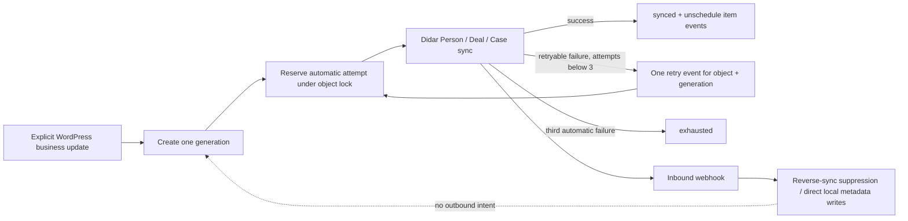

# ns-didar Sync Generation and Retry Cap

## Contract

A sync generation is one explicit outbound intent created by a user/admin request action. It has a UUID, payload fingerprint, source, timestamps, separate automatic/manual counts, status, error, and next retry time. The fingerprint is an idempotency aid only: an explicit second save of the same business value creates a new UUID and a fresh automatic budget.

Example: an admin saves `initial_approval`, Generation A exhausts after three automatic failures, then later saves `initial_approval` again. The later POST creates Generation B even though its fingerprint matches A. Updating `_didar_sync_state`, Deal/Person/Case IDs, history, locks, cron metadata, or inbound webhook values creates no generation.

## Sources

| Source | Classification | Generation behavior |
|---|---|---|
| Frontend create/edit, applicant/agent edit, admin Update | USER/BUSINESS | New submission generation |
| Workflow/public/internal status action | USER/BUSINESS | New submission generation; duplicate hooks in the same request share it |
| Profile save or profile document change | USER/BUSINESS | New Person generation |
| User registration and verified mobile registration write | USER/BUSINESS | New Person generation; same-request hooks share it |
| Admin/queue-manager Run Now | MANUAL OVERRIDE | Reuses exhausted generation; no automatic reset/retry chain |
| Cron callback and five-minute sweep | RETRY | Reuses expected generation only |
| State/attempt/error writes, locks, Deal/Person/Case ID persistence, event history | INTERNAL | No generation |
| Didar Person/Deal webhook and duplicate webhook replay | WEBHOOK | No generation |

## Loop Paths and Guards

| Loop Path | Guard | Hard Cap | Test Result |
|---|---|---|---|
| WP save → Didar → webhook → WP | request-local reverse-sync suppression; webhook writes do not emit submission intent | generation auto count | source guard audit; transport seam requires a configured local test transport |
| Deal ID persistence → WordPress hooks | no generic `save_post`/meta outbound hook | generation auto count | internal-write regression test |
| Case ID persistence → parent sync → Case sync | Case has no independent queue; parent generation owns it | generation auto count | internal-write regression test and parent-state audit |
| Person ID/profile sync metadata → Person sync | queueing is limited to explicit registration/profile/mobile actions | generation auto count | trigger audit and Person cap test |
| Retry state/history/lock writes → new queue item | only business service actions call queue creation | generation auto count | internal-write regression test |
| Successful item → stale cron | `synced` fails eligibility and item events are removed | 3 automatic executions | covered by 100-callback test |
| Duplicate cron events | `(object_id, generation_id)` schedule identity | 3 automatic executions | covered by scheduling test |
| Concurrent callbacks | atomic option lock and pre-call attempt reservation | 3 automatic executions | covered by lock test |
| Duplicate webhook delivery | persistent event-id ledger | no outbound generation | existing webhook dedupe coverage |
| Queue inspection or purge → execution | inventory is read-only; discard only removes local state/events | no automatic execution | queue-manager implementation audit |

## Legacy State

Legacy state is normalized only when read by the queue/worker. A legacy `attempts` value is preserved and capped at three. A state with no reliable counter is marked conservatively exhausted; it is not reset to `0/3` and therefore cannot create a replay flood. An authorized manual run remains available.

## Admin Queue

`تشخیص و گزارش → مدیریت صف همگام‌سازی` shows a short generation identifier, `تلاش خودکار: N از 3`, status, next run, and sanitized last error. Exhausted rows keep `اجرای فوری`; manual failure stays failed/exhausted and never schedules automatic attempt four.

## Verification Scope

Controlled local tests cover three automatic failures, repeated stale callbacks, successful stale callbacks, manual override semantics, identical explicit re-save, cron deduplication, submission locks, and equivalent Person exhaustion. No production data or Didar endpoint was changed for this work.
